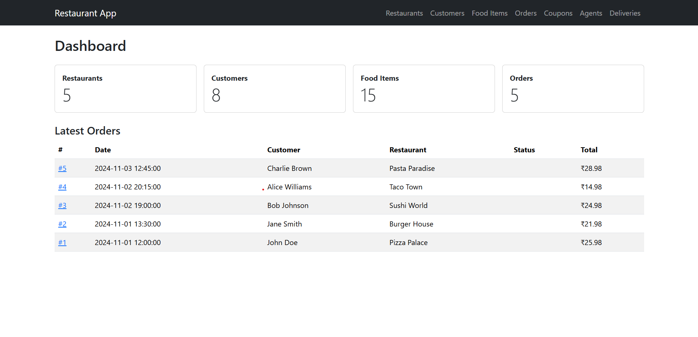

<!-- Banner (store your image at assets/banner.png) -->

  

<h1 align="center">👋 Hey, I'm Himayat Tiwana</h1>

  <b>Software Developer • AI & Full-Stack Projects</b> 
  Passionate about building intelligent systems and practical web applications.

  
  

## 🚀 Featured Projects

### 🍴 Restaurant Food Delivery Management System
A complete web app for managing restaurants, customers, menu items, orders, deliveries, and coupons.  
**Stack:** Flask 3.x, MySQL (local) / SQLite (Render), Gunicorn  
**Links:**  
[Live Demo](https://restaurant-food-delivery-management.onrender.com) •
[Source Code](https://github.com/himayattiwana/Restaurant-Food-Delivery-Management-System)

  <!-- Replace with a real screenshot saved at assets/restaurant.png -->
  

---

### 🚨 Smart Disaster Response & Rescue Agent
AI-powered disaster simulation where intelligent rescue agents navigate grids using **A\*** pathfinding, **Genetic Algorithms**, and **K-Means clustering** to optimize search & rescue.  
**Frontend:** Flask + JavaScript interactive visualization  
**Links:**  
[Live Demo](https://smart-disaster-response-and-rescue-agent-vov6.onrender.com/) •
[Source Code](https://github.com/himayattiwana/Smart-Disaster-Response-and-Rescue-Agent)

  

## 🧠 Tech Stack

  
  
  
  
  
  
  
  

## 📬 Connect With Me

  
  
  

  <i>“Code. Debug. Deploy. Learn. Repeat.”</i>

